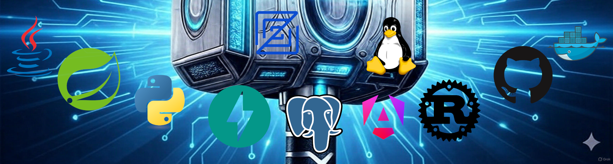

# Welcome to TechThorDev! Your Deep Dive into Full-Stack & DevOps

Welcome to my blog! My name is Thorsten Fey, and this is your hub for in-depth technical insights and practical guides from the world of modern software development.

Here, I share my experiences and solutions from my **Tech Journey as a Self-Taught Developer**. The focus is clearly on robust, practical solutions that work in real-world scenarios.

### What You Will Find Here:

* **Backend & APIs:** Detailed guides and deep dives into Java and the **Spring Boot** framework.
* **Frontend & UI:** Modern application development with **Angular** and **TypeScript**.
* **DevOps & Infrastructure:** Everything about **Docker** containerization, **GitHub Actions**, and migration to serverless architectures like **Google Cloud Run (GCP)**.
* **Databases:** Best practices, performance optimization, and advanced usage of **PostgreSQL**.
* **Polyglot Programming:** Occasional forays into new languages like **Rust** and **Python**.

Whether you are looking for migration guides, ready-to-use code snippets, or transparent insights into real-world challenges—here you will find the answers that will help you on your own development journey.

Happy reading and exploring!

***

